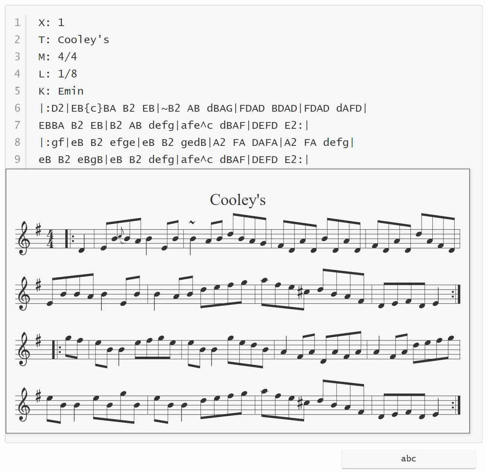

# Typora Plugin ABC Music Notation

[English](./README.md) | 简体中文

这是一个基于 [typora-community-plugin][core] 开发的，适用于 [Typora](https://typora.io) 的插件。

此插件支持在代码块中使用 ABC 记谱法。

## 预览

## 安装

1. 安装 [typora-community-plugin][core]
2. 在 “设置 -> 插件市场” 中搜索 “ABC Music Notation” 并安装

[core]: https://github.com/typora-community-plugin/typora-community-plugin
